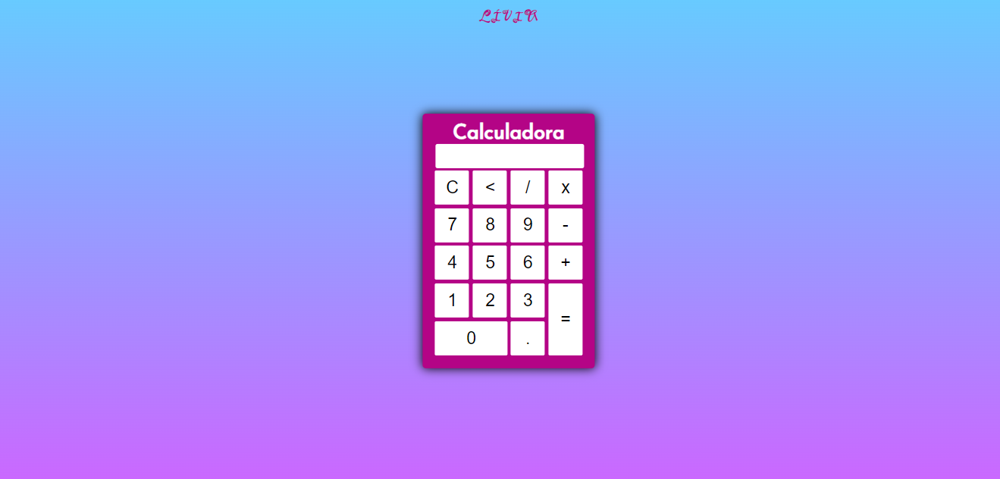

<h1> CALCULADORA BÁSICA </h1>
<a href="https://liviaandressa.github.io/calculadora/">Link para a página da calculadora</a>

<h2> O que foi utilizado para construção da calculadora </h1>
<ul>
  <li> HTML5 </li>
  <li> CSS3 </li>
  <li> JS </li>
 </ul>
 
 <h2> Cálculos básicos de:  </h2>
 <ul>
  <li> Adição </li>
  <li> Subtração </li>
  <li> Divisão </li>
  <li> Multiplicação </li>
 </ul>
 
 

 
